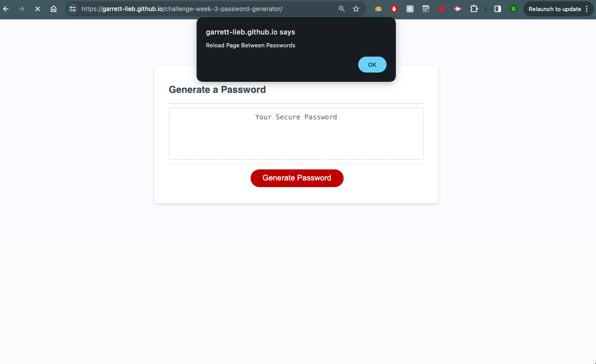
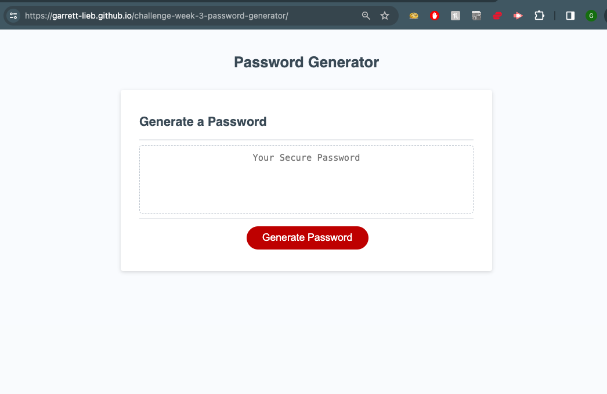
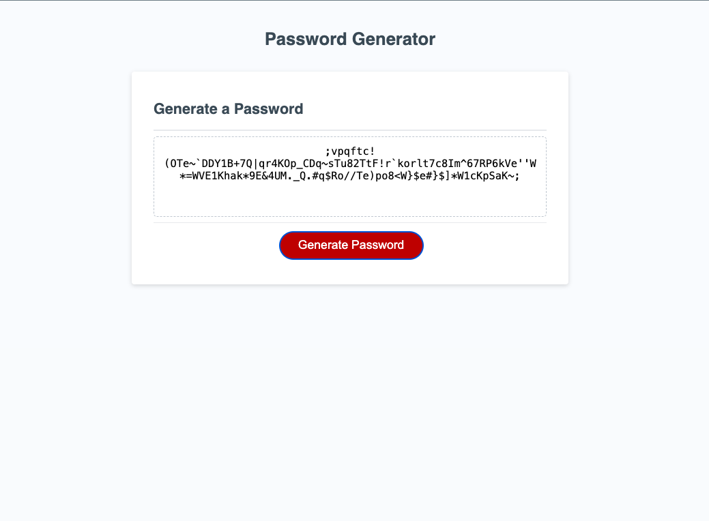

# challenge-week-3-password-generator

 ## Description

This page was created from existing html, css, and javascript code for a challenge exercise by students at the edX coding bootcamp through the U of Oregon. As part of their introduction to Javascript, students mainly focused on adding functionality to a password generator page for a fictitious client. They were provided with the HTML and CSS sheets as well as the two (2)  sections of Javascript shown in the source code. From there stuents added user prompts to ask the user to select a character length of 8-128, and then to narrow the types characters used if the user chose to do so while making sure the password includes at least one character type and the acceptable number of characters set forth in the assignment.

[ DEPLOYED PAGE: 
   https://garrett-lieb.github.io/challenge-week-3-password-generator/]

[ Garrett Lieb GITHUB REPO: 
    https://github.com/garrett-lieb/challenge-week-3-password-generator]

 ## Installtion

N/A

 ## Usage

As the notification upon loading the page indicates, it must be reloaded between generating passwords. Click the generate password button to begin the process and  answer the the "confirm" prompts loadedby Javascript in the browser window. The page will return a password meeting the user's specifiations in the appropriate text field on the page. 

 ## Credit

N/A

 ## Liscence

MIT Liscence

Copyright (c) 2023 Garrett Lieb

Permission is hereby granted, free of charge, to any person obtaining a copy of this software and associated documentation files (the "Software"), to deal in the Software without restriction, including without limitation the rights to use, copy, modify, merge, publish, distribute, sublicense, and/or sell copies of the Software, and to permit persons to whom the Software is furnished to do so, subject to the following conditions:

The above copyright notice and this permission notice shall be included in all copies or substantial portions of the Software.

THE SOFTWARE IS PROVIDED "AS IS", WITHOUT WARRANTY OF ANY KIND, EXPRESS OR IMPLIED, INCLUDING BUT NOT LIMITED TO THE WARRANTIES OF MERCHANTABILITY, FITNESS FOR A PARTICULAR PURPOSE AND NONINFRINGEMENT. IN NO EVENT SHALL THE AUTHORS OR COPYRIGHT HOLDERS BE LIABLE FOR ANY CLAIM, DAMAGES OR OTHER LIABILITY, WHETHER IN AN ACTION OF CONTRACT, TORT OR OTHERWISE, ARISING FROM, OUT OF OR IN CONNECTION WITH THE SOFTWARE OR THE USE OR OTHER DEALINGS IN THE SOFTWARE.